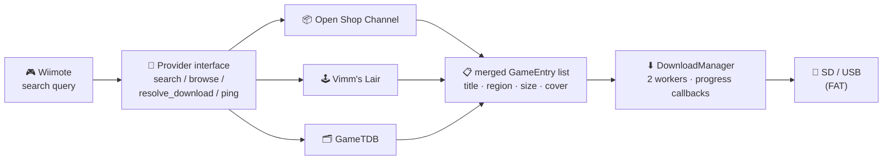

# wii-meta-client

> **Every Wii download source, one app.** A Wii homebrew meta-client: browse and download games and homebrew from the Open Shop Channel, Vimm's Lair, and GameTDB — search once, see everything, queue downloads to SD/USB.

<div align="right">

[](#quick-start)
[](data/meta.xml)
[](#quick-start)
[](https://github.com/toxicwind/wii-meta-client)

</div>

## Why you should care

Wii homebrew downloads are scattered: one site for Open Shop Channel packages, another for Vimm's Lair ROMs, a third for GameTDB metadata and covers. **Wii Meta-Client** unifies them behind one on-console browser with a real search box, a download queue with progress, and covers — so you stop juggling websites on your phone and start downloading on the TV.

**Who it's for:** Wii homebrew users (and devkitPPC hackers) who want a single download front-end on the console.

## Features

- **Three providers, one search** — Open Shop Channel, Vimm's Lair, GameTDB. One query fans out; results merge into a single list with source, region, size, and cover art.
- **Download manager** — multi-worker queue with live progress (bytes, totals, speed); downloads land on SD/USB via FAT.
- **Cover art** — per-entry `cover_url` rendered in the UI (libpng/libjpeg).
- **Console-native UI** — GRRLIB rendering, Wiimote input, 640×480, highlight/error color scheme.
- **Homebrew Channel ready** — ships `data/meta.xml` (name, version 0.1.0, descriptions) for the HBC app list.
- **Jellyfin reference code** — `source/wiifin_ref/` carries a standalone Jellyfin client (libraries, seasons, episodes, playback positions): reference implementation, not yet wired into the app.

> **Note:** an Archive.org provider factory is declared in `source/providers/provider.h` but has no implementation yet — the three providers above are the ones registered in `main()`.

## How it works



## Quick start

Prerequisites: [devkitPPC](https://devkitpro.org/) with libogc and GRRLIB installed, `DEVKITPPC` set in your environment.

```bash
make            # builds wii-meta-client.dol (+ .elf, .map)
make run        # sends the .dol to the Wii over the network via wiiload
```

Or copy `wii-meta-client.dol` + `data/meta.xml` to `apps/wii-meta-client/` on your SD card and launch from the Homebrew Channel.

## Architecture

| Area | Files | What it does |
|---|---|---|
| App loop / UI | `source/main.cpp` | GRRLIB init, Wiimote input, provider registry, screen rendering, queue view |
| Provider interface | `source/providers/provider.h` | Abstract `Provider`: `search`, `browse`, `resolve_download`, `ping`, progress callbacks; `GameEntry` / `SearchResult` structs |
| Providers | `source/providers/osc.cpp`, `vimm.cpp`, `gametdb.cpp` | One implementation per source behind the common interface |
| Downloads | `source/network/download*.{cpp,h}`, `http.{c,cpp,h}` | HTTP client + multi-worker download manager |
| Parsing | `source/utils/{html,json,xml}.cpp` | Lightweight HTML/JSON/XML parsing for provider responses |
| Jellyfin (reference) | `source/wiifin_ref/` | `JellyfinClient`, `LibraryView`, `App`, `Input` — standalone reference, not integrated |
| HBC metadata | `data/meta.xml` | Homebrew Channel listing: name, version, descriptions |

`main()` registers the three providers, inits network (`if_config`) and FAT, then hands control to the UI loop; the download manager runs its workers in the background while you keep browsing.

## Config

- **`data/meta.xml`** — Homebrew Channel metadata (app name, version `0.1.0`, short/long description). Edit before release builds.
- **Build flags** — `Makefile`: `-g -O2 -Wall`; libs `-lgrrlib -lfreetype -lpng -ljpeg -lz -lwiiuse -lbte -lasnd -lfat -lwiikeyboard -logc -lm`. Sources are globbed from `source/`, `source/network/`, `source/providers/`, `source/utils/`.

## Development & contributing

```bash
make clean && make     # full rebuild
```

Add a new source by implementing the `Provider` interface in `source/providers/` (see `provider.h`) and registering its factory in `main.cpp`. The `wiifin_ref/` Jellyfin code is the natural next integration target. PRs welcome.

## License & security

No license file has been declared yet — all rights reserved by default until one is added.

- **Third-party sources:** downloads come from Vimm's Lair, the Open Shop Channel, and GameTDB. Only download content you own or that is freely distributable.
- **Hardware access:** `meta.xml` sets `<ahb_access/>` (direct hardware access flag for the Homebrew Channel).
- **Network:** the app opens its own network connection (`if_config`) and fetches over HTTP — provider endpoints and your LAN see that traffic.
